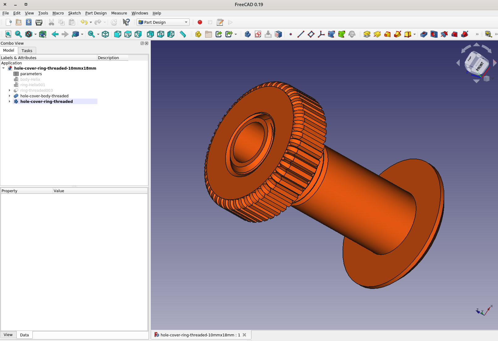
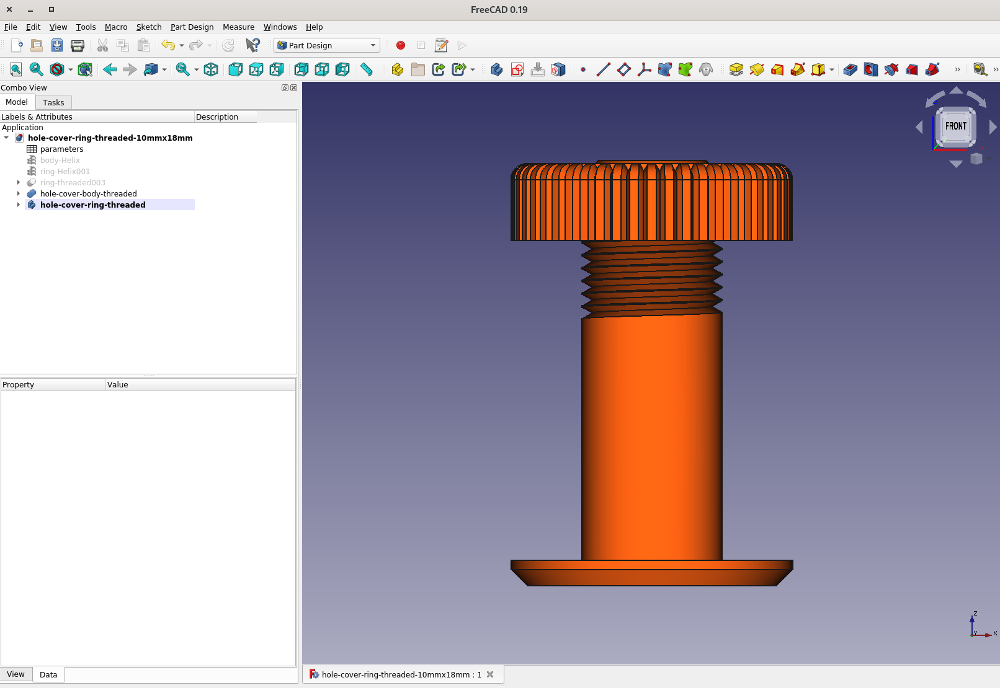
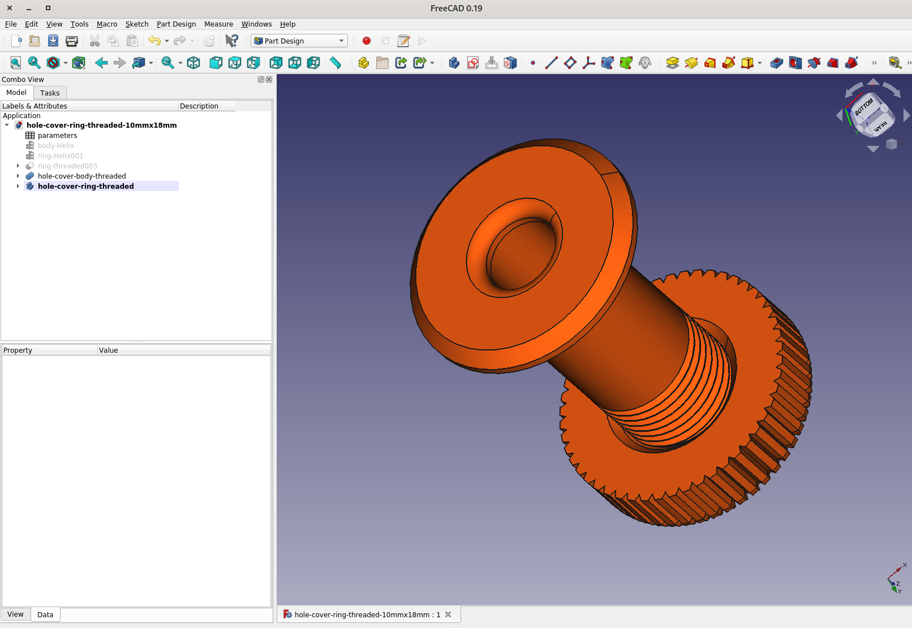
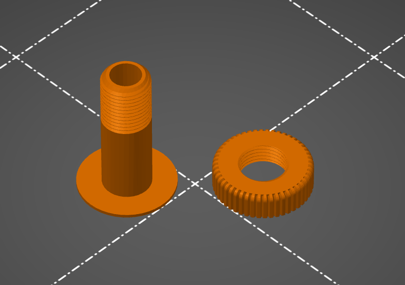
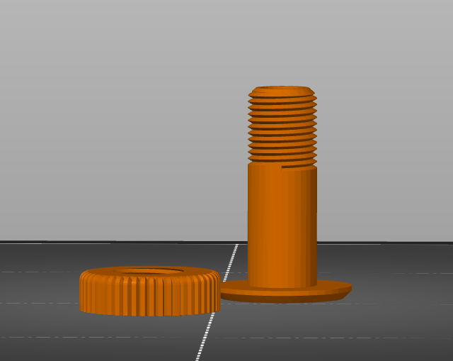
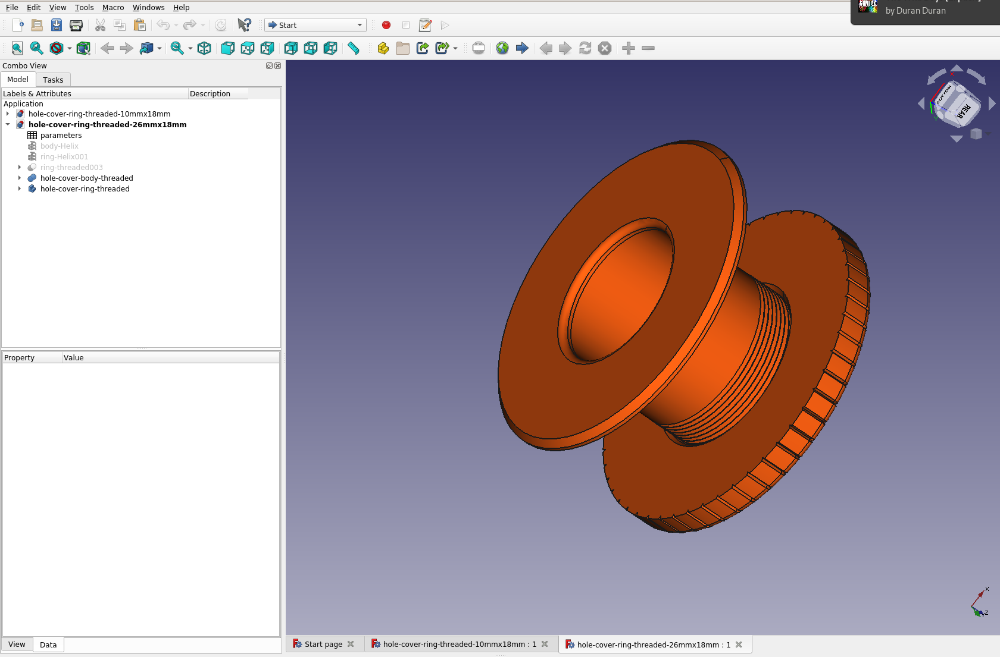
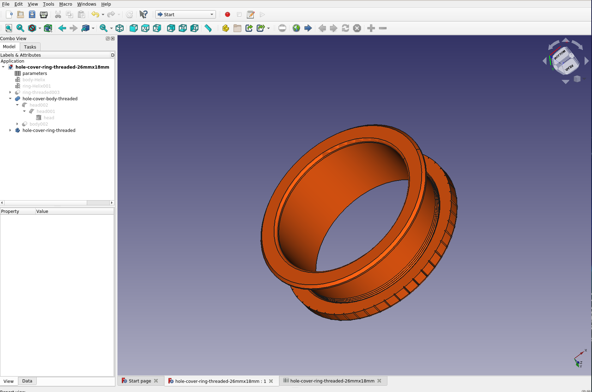

# 3d-printing-hole-covers

This 3d Printing hole covers collections made using [FreeCAD](https://www.freecadweb.org/)

## hole-cover-threaded-10mmx18mm

## hole-cover-ring-threaded-26mmx18mm

## License

This module is released under the GNU General Public License Version 3:

* [http://www.gnu.org/licenses/gpl-3.0-standalone.html](http://www.gnu.org/licenses/gpl-3.0-standalone.html)

## Author Information

* [Christian González Di Antonio](https://github.com/christiangda)
